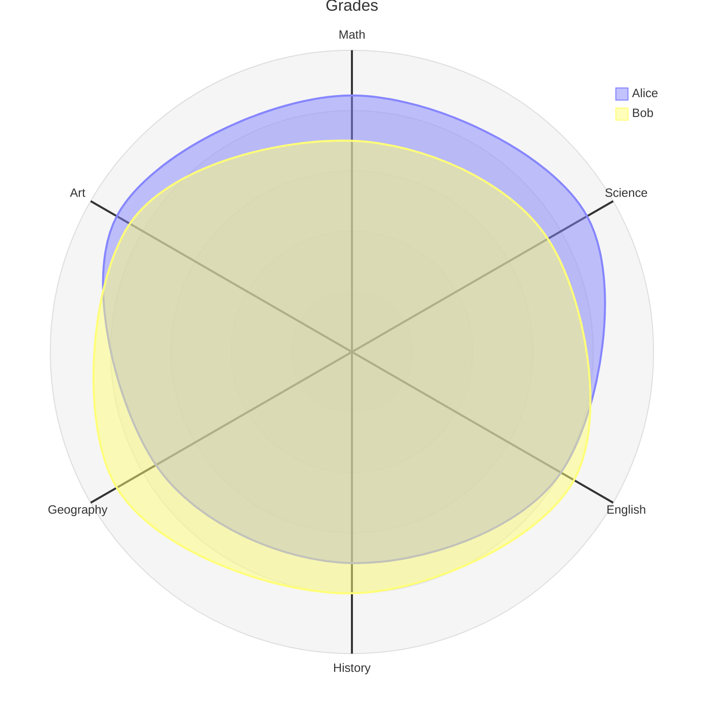

import { Tabs, TabItem } from '@astrojs/starlight/components';

[Starlight](https://starlight.astro.build/)을 내 요구사항에 맞게 사용하기 위해 적절한 조정이 필요했다.  
다음은 Starlight(25년 4월 기준)에서는 기본 제공하지 않지만 내게 필요한 기능들이다.

1. `$`를 이용한 $\TeX$ 수식 작성 기능 (인라인과 블록 형태를 모두 지원)
2. [Mermaid](https://mermaid.js.org/intro/) 기반의 다이어그램 렌더링 기능

이에 따라 아래의 단계를 거쳐 요구사항을 만족시켰다.  
*-- 이하에서 위 두 기능을 순서대로 각각 '수식', '다이어그램'으로 약기한다.*

## 1. 패키지 설치

<Tabs syncKey="content-type">

<TabItem label="수식">
```shell
npm install remark-math rehype-mathjax
```
</TabItem>

<TabItem label="다이어그램">
```shell
npm install remark-mermaidjs
npm init playwright@latest  # 대화형 설치 과정 진행
```
</TabItem>

</Tabs>

## 2. `astro.config.mjs` 설정

<Tabs syncKey="content-type">

<TabItem label="수식">
```diff lang="js"
import { defineConfig } from 'astro/config';
import starlight from '@astrojs/starlight';
+import remarkMath from 'remark-math';
+import rehypeMathJax from 'rehype-mathjax';

export default defineConfig({
  // 이하의 'markdown' 항목이 없다면 추가
  markdown: {
+    remarkPlugins: [remarkMath],
+    rehypePlugins: [rehypeMathJax],
  },

  integrations: [
    starlight({
      // ...
      // 인라인 수식을 위한 설정 (아래 디렉토리에 CSS 파일 생성 필요)
+			customCss: ['./src/mathjax.css'],
    }),
  ],
});
```
</TabItem>

<TabItem label="다이어그램">
```diff lang="js"
import { defineConfig } from 'astro/config';
import starlight from '@astrojs/starlight';
+import remarkMermaid from 'remark-mermaidjs';

export default defineConfig({
  // 이하의 'markdown' 항목이 없다면 추가
  markdown: {
+    remarkPlugins: [remarkMermaid],
  },

	integrations: [
		starlight({
      // ...
    }),
  ],
});
```
</TabItem>

</Tabs>

## 3. 추가 작성 (수식 기능)

코드에서 주석으로 언급했듯이, 인라인 수식을 위해서는 별도의 CSS 파일 작성이 필요하다.

```css
/* src/mathjax.css */
mjx-container svg {
    display: inline !important;
}
```

## A. -- 정리 --

이상 Starlight에서 수식과 Mermaid 다이어그램을 렌더링할 수 있는 방법을 소개했다.  
참고로, 이 둘의 설정을 모두 적용한 `astro.config.mjs`의 모습은 아래와 같다.

```diff lang="js"
// astro.config.mjs
import { defineConfig } from 'astro/config';
import starlight from '@astrojs/starlight';
+import remarkMath from 'remark-math';
+import rehypeMathJax from 'rehype-mathjax';
+import remarkMermaid from 'remark-mermaidjs';

export default defineConfig({
  markdown: {
+		remarkPlugins: [remarkMath, remarkMermaid],
+		rehypePlugins: [rehypeMathJax],
  },

  integrations: [
    starlight({
+			customCss: ['./src/mathjax.css'],
      // ...
    }),
  ],
});
```

끝으로 수식과 다이어그램 각각의 예시 작성과 해당 렌더링 모습을 보인다.

### A.1 수식
---

$$
A_{m,n} = 
  \begin{pmatrix}
    a_{1,1} & a_{1,2} & \cdots & a_{1,n} \\
    a_{2,1} & a_{2,2} & \cdots & a_{2,n} \\
    \vdots  & \vdots  & \ddots & \vdots  \\
    a_{m,1} & a_{m,2} & \cdots & a_{m,n} 
 \end{pmatrix}
$$

```latex
A_{m,n} = 
  \begin{pmatrix}
    a_{1,1} & a_{1,2} & \cdots & a_{1,n} \\
    a_{2,1} & a_{2,2} & \cdots & a_{2,n} \\
    \vdots  & \vdots  & \ddots & \vdots  \\
    a_{m,1} & a_{m,2} & \cdots & a_{m,n} 
 \end{pmatrix}
```

### A.2 다이어그램
---

*최신 유형 '레이더 다이어그램'의 베타 버전을 표시한다.*


```markdown
---
title: "Grades"
---
radar-beta
  axis m["Math"], s["Science"], e["English"]
  axis h["History"], g["Geography"], a["Art"]
  curve a["Alice"]{85, 90, 80, 70, 75, 90}
  curve b["Bob"]{70, 75, 85, 80, 90, 85}

  max 100
  min 0
```

## B. -- reference --
- [수식 | GitHub discussion](https://github.com/withastro/starlight/discussions/968#discussioncomment-7385096)
- [다이어그램 | Agramont blog ](https://agramont.net/blog/diagraming-with-mermaidjs-astro/#starlight)